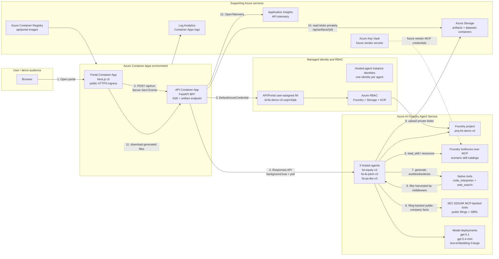

# FSI Multi-Agent Demo on Azure AI Foundry

This repository contains a live Financial Services Industry (FSI) demo that adapts Anthropic's [`financial-analysis`](https://github.com/anthropics/financial-services/tree/main/plugins/vertical-plugins/financial-analysis/skills) skill patterns into **scenario-based Azure AI Foundry hosted agents**.

The current deployment is **v3**. It keeps the earlier v1/v2 deployments untouched and runs in a separate Azure resource group with three real Foundry hosted agents, one per business scenario.

All companies, peers, figures, and assumptions are synthetic for demonstration only. This is not investment advice.

## Live deployment

| Resource | Value |
|---|---|
| Portal | https://ca-portal-fsi-demo-v3.politeocean-8e501b06.eastus2.azurecontainerapps.io |
| API | https://ca-api-fsi-demo-v3.politeocean-8e501b06.eastus2.azurecontainerapps.io |
| Azure resource group | `rg-fsi-demo-v3` |
| Region | `eastus2` |
| Subscription | `6a7da9fe-e881-4d1a-bf1b-c5f4fc3530ac` |
| Foundry project endpoint | `https://aifxzqm33pk.services.ai.azure.com/api/projects/proj-fsi-demo-v3` |
| Foundry account / project | `aifxzqm33pk` / `proj-fsi-demo-v3` |
| Storage account | `stxzqm33pk` |
| ACR | `acrxzqm33pk.azurecr.io` |

## Scenarios and agent landscape

The agent landscape is scenario-based, not skill-based. Each hosted agent owns a business workflow and gets a scenario-specific toolbox containing the skills it needs.

| Scenario | Hosted agent | Toolbox | Anthropic financial-analysis skills used | Output |
|---|---|---|---|---|
| **Equity Research and Valuation** | `fsi-equity-v3` | `tb-equity-research` | `company-research`, `3-statement-model`, `dcf-model`, `comparable-company-analysis`, `xlsx-author`, `financial-analysis-report`; SEC EDGAR filing tools for public tickers | `.xlsx` valuation workbook |
| **Investment Banking Pitch** | `fsi-ib-pitch-v3` | `tb-ib-pitch` | `company-research`, `competitive-analysis`, `comparable-company-analysis`, `financial-analysis-report`, `pptx-author`, `presentation-formatting`, `deck-quality-review`; SEC EDGAR 10-K/10-Q context for public issuers | `.pptx` pitch deck |
| **Private Equity LBO Screening** | `fsi-pe-lbo-v3` | `tb-pe-lbo` | `company-research`, `lbo-model`, `financial-model-audit`, `xlsx-author`; SEC EDGAR financials for public LBO targets where applicable | `.xlsx` LBO workbook |

This replaced the older v1 design with 8 specialist prompt agents plus 3 orchestrators. In v3, the scenario hosted agent is the durable runtime boundary; skills are loaded progressively through the toolbox MCP surface.

## Repository structure

```text
.
|-- agents/
|   |-- hosted/      # Foundry hosted-agent source, Blob artifact egress, azd agent deployment
|   `-- skills/      # Skill material adapted from Anthropic financial-analysis
|-- api/             # FastAPI BFF: background Responses invoke, SSE, artifact proxy, telemetry
|-- data/            # Synthetic FSI datasets for NovaGrid Technologies and fictional peers
|-- docs/            # Runbook and standalone HTML report
|-- infra/           # Bicep infrastructure for v1/v2-style app resources and shared patterns
|-- portal/          # Next.js web portal
`-- scripts/         # Scenario validation helpers
```

## Azure architecture



## Where Azure services and features are used

| Azure service / feature | Current v3 resource | Purpose in the flow |
|---|---|---|
| **Resource Group** | `rg-fsi-demo-v3` | Isolates the new hosted-agent iteration from the live v1/v2 deployments. |
| **Azure AI Foundry / AI Services account** | `aifxzqm33pk` | Parent account for model deployments, the Foundry project, toolboxes, and hosted agents. |
| **Foundry project** | `proj-fsi-demo-v3` | Data-plane endpoint used by the API and hosted agents. |
| **Foundry hosted agents** | `fsi-equity-v3`, `fsi-ib-pitch-v3`, `fsi-pe-lbo-v3` | Containerized custom Python agent runtime deployed into Foundry Agent Service through `azd ai agent`. |
| **Foundry toolbox MCP** | `tb-equity-research`, `tb-ib-pitch`, `tb-pe-lbo` | Scenario-specific skill catalogs. Hosted agents load Anthropic-style skills through `FoundryToolbox.as_skills_provider()`. |
| **SEC EDGAR remote MCP tool** | Self-hosted `sec-edgar-mcp` Container App (`ca-secedgar-mcp-*`), consumed as a Foundry-native remote (hosted) MCP tool | Gives suitable agents keyless public filing access for company metadata, recent filings, 10-K/10-Q sections, XBRL financials, key metrics, and period comparisons. The Foundry gateway connects to the MCP Container App and injects a shared-secret header (`x-fsi-mcp-key`); no SEC code runs in the agent image and the endpoint is not usable without the key. Requires a compliant `SEC_EDGAR_USER_AGENT`; no SEC subscription key is required. Upstream package license is AGPL-3.0; review licensing before commercial redistribution. |
| **Code Interpreter** | Native Foundry tool attached in hosted-agent code | Generates real `.xlsx` and `.pptx` files. The toolbox preview Code Interpreter path was not used because it returned server-side 500s during validation. |
| **Web Search** | Native Foundry tool attached in hosted-agent code | Gives the agents grounding capability where market context is useful. |
| **Azure Storage Blob** | `stxzqm33pk`, container `artifacts` | Stores generated workbooks and decks uploaded by hosted-agent middleware; API downloads privately and exposes `/api/artifacts/{id}`. AAD/RBAC-only (`allowSharedKeyAccess=false`, no anonymous blob access); `publicNetworkAccess` stays **Enabled** so both the hosted-agent managed compute and the VNet-less Container Apps BFF can reach it -- disabling it breaks artifact upload with `AuthorizationFailure`. |
| **Azure Container Apps** | `ca-api-fsi-demo-v3`, `ca-portal-fsi-demo-v3` | Hosts the FastAPI BFF and Next.js portal with public HTTPS ingress. |
| **Azure Container Registry** | `acrxzqm33pk` | Stores `fsi-api:v3` and `fsi-portal:v3` images consumed by Container Apps. |
| **Managed identities** | App UAMI plus one hosted-agent instance identity per agent | Removes secrets from runtime auth. API identity invokes Foundry and reads Storage; each hosted-agent identity reads toolbox resources and writes artifacts. |
| **Azure RBAC** | Cognitive Services User, Foundry User, Storage Blob Data Contributor, AcrPull | Grants least-required data-plane access for app and agent identities. |
| **Application Insights** | v3 Application Insights resource | Receives API telemetry and scenario spans. Hosted-agent framework instrumentation is intentionally disabled in code to avoid a current serialization issue with Code Interpreter tool params. |
| **Key Vault** | `kv-fsi-demo-v3-xzqm33pk` | Reserved for future vendor MCP credentials such as FactSet, PitchBook, Moody's, LSEG, and document stores. |

Official references:

- [Azure AI Foundry hosted agents](https://learn.microsoft.com/azure/ai-foundry/agents/concepts/hosted-agents?view=foundry)
- [Azure AI Foundry Agent Service runtime components](https://learn.microsoft.com/azure/ai-foundry/agents/concepts/runtime-components?view=foundry)
- [Azure AI Foundry tools overview](https://learn.microsoft.com/azure/ai-foundry/agents/how-to/tools/overview?view=foundry)
- [Azure Container Apps](https://learn.microsoft.com/azure/container-apps/overview)

## Runtime flow

1. A user opens the Next.js portal hosted on Azure Container Apps.
2. The portal loads scenario metadata from the FastAPI backend:
   - `GET /api/scenarios`
   - `GET /api/toolboxes`
3. The user starts a scenario with:
   - `POST /api/run`
   - body: `{ "scenario": "equity-research" | "ib-pitch" | "pe-lbo", "message": "..." }`
4. The API authenticates with `DefaultAzureCredential` using the Container App user-assigned managed identity.
5. The API submits a Foundry Responses request to the selected hosted agent using background mode:
   - `stream: false`
   - `store: true`
   - `background: true`
6. The API polls the response until completion. This avoids long-running gateway disconnects during Code Interpreter work.
7. The hosted agent loads only the required skills from its scenario toolbox via MCP. For real public tickers, it can call SEC EDGAR MCP-backed tools before using native Code Interpreter and Web Search.
8. The hosted agent's `ArtifactEgressMiddleware` harvests Code Interpreter files, uploads them to the private `artifacts` Blob container, and appends a sentinel like:

   ```text
   <<<ARTIFACT name=NovaGrid_valuation_snapshot.xlsx blob=artifacts/<path>/NovaGrid_valuation_snapshot.xlsx>>>
   ```

9. The API parses the sentinel, downloads the blob privately with managed identity, registers an in-memory artifact ID, strips the sentinel from the model text, and streams the final answer plus artifact link to the portal.
10. The portal renders the narrative and a download link backed by:

    ```text
    GET /api/artifacts/{artifact_id}
    ```

## Artifact handling

Generated artifacts are visible in the portal after a scenario finishes. The important v3 change is that files are now persisted to Azure Blob Storage by the hosted agent before the API exposes them.

This is more durable than the v1/v2 temp-file approach and avoids returning SAS URLs to the browser. The browser talks only to the API; the API uses managed identity to retrieve private blobs.

Operational resilience: if a hosted run completes but the hosted artifact middleware does not emit a Blob sentinel, the API issues one corrective artifact turn. If no sentinel is still available, the API registers a valid one-sheet summary `.xlsx` from the agent narrative so the portal download contract remains intact for demos. The primary path remains hosted Code Interpreter -> Blob sentinel -> private artifact download.

Validated live artifacts:

| Scenario | Artifact |
|---|---|
| Equity Research and Valuation | `NovaGrid_valuation_snapshot.xlsx` |
| Private Equity LBO Screening | `NovaGrid_Compact_LBO.xlsx` |
| Investment Banking Pitch | `NovaGrid_pitch_demo.pptx` |
| SEC EDGAR public-filing smoke test | `sec_smoketest_aapl.xlsx` using AAPL latest 10-K metadata |

## Observability

The API is instrumented with `azure-monitor-opentelemetry` in `api/app/telemetry.py`.

Health check:

```powershell
Invoke-RestMethod https://ca-api-fsi-demo-v3.politeocean-8e501b06.eastus2.azurecontainerapps.io/api/health
```

Expected signal:

```json
{
  "status": "ok",
  "telemetry": true
}
```

Useful Application Insights query:

```kusto
dependencies
| where timestamp > ago(1h)
| where name in ("scenario.run", "foundry.background.submit", "foundry.background.poll")
| project timestamp, name, customDimensions
| order by timestamp desc
```

## Reusable build pattern: Anthropic skills on Azure

Use this repo as a repeatable pattern for taking Anthropic-style `SKILL.md` folders and running them through Azure AI Foundry hosted agents.

1. **Pin the upstream skill source.** Treat Anthropic's `financial-analysis/skills` folder as the source catalog. Copy or fetch only the skills needed for your scenarios, keep their `SKILL.md` bodies intact where possible, and record any adaptation you make for Azure hosted execution.
2. **Map skills to scenarios, not agents.** Keep the runtime agent count aligned to business workflows. This demo uses three scenario hosted agents and attaches reusable skills to scenario toolboxes: equity research, IB pitch, and PE LBO. Cross-cutting skills such as `xlsx-author`, `clean-data-xls`, and `audit-xls` can appear in more than one toolbox.
3. **Register Foundry skills.** Use `agents\scripts\provision_skills.py` to register each `SKILL.md` as a Foundry skill in the project. Skills are centrally governed and versionable instead of being pasted into static agent prompts.
4. **Bind skills to Foundry toolboxes.** Use `agents\scripts\bind_skills_to_toolboxes.py` to attach skill references to `tb-equity-research`, `tb-ib-pitch`, and `tb-pe-lbo`, then promote the toolbox version to default. The hosted runtime consumes skills through toolbox MCP resources and `load_skill`.
5. **Run scenario hosted agents.** `agents\hosted\fsi_hosted_agent_v3.py` is one env-driven hosted-agent module. Each `azure.yaml` service sets the scenario title, brief, and toolbox endpoint. The runtime uses `FoundryToolbox.as_skills_provider()` for skills (the toolbox is connected via `async with toolbox:` in `main()`, NOT placed in the agent `tools` list -- that would suppress the native tools), native Foundry `code_interpreter` and `web_search` for reliable execution, and the SEC EDGAR remote MCP tool for keyless public filings.
6. **Keep SEC EDGAR private.** The demo runs `sec-edgar-mcp` as a self-hosted Container App and attaches it to the agents as a Foundry-native remote MCP tool; the gateway injects a shared-secret header (`x-fsi-mcp-key`), so the endpoint is not usable without the key. No SEC code runs in the agent image. Do not publish the MCP endpoint unauthenticated. Set `SEC_EDGAR_USER_AGENT` to a real contact string and keep `SEC_EDGAR_RATE_LIMIT` conservative. Toggle the tool by setting/clearing `SEC_EDGAR_MCP_URL` (azd env).
7. **Front with a BFF and portal.** The FastAPI BFF invokes hosted agents through Responses `background:true` + polling, parses Blob artifact sentinels, and streams status/artifact events to the Next.js portal. If hosted artifact egress misses a file, the BFF creates a valid one-sheet fallback workbook from the final agent narrative so the UI always has a downloadable artifact for completed runs.
8. **Keep artifact storage network-reachable.** Blob egress relies on the hosted-agent managed compute reaching Storage over AAD/RBAC. Keep `publicNetworkAccess=Enabled` on the storage account (still `allowSharedKeyAccess=false`, no anonymous access) unless you add private endpoints for both the agent compute and the Container Apps env; otherwise uploads fail with `AuthorizationFailure` even with correct RBAC.
9. **Validate both API and UI.** Use the API validator for quick regression checks, then run the browser-driven portal validation for the same path a demo user clicks: scenario card -> prompt -> run -> timeline -> artifact download.

Official references used for the design:

- [Azure AI Foundry hosted agents](https://learn.microsoft.com/azure/ai-foundry/agents/concepts/hosted-agents?view=foundry)
- [Azure AI Foundry Agent Service runtime components](https://learn.microsoft.com/azure/ai-foundry/agents/concepts/runtime-components?view=foundry)
- [Azure AI Foundry tools overview](https://learn.microsoft.com/azure/ai-foundry/agents/how-to/tools/overview?view=foundry)
- [Anthropic financial-analysis skills](https://github.com/anthropics/financial-services/tree/main/plugins/vertical-plugins/financial-analysis/skills)
- [`sec-edgar-mcp`](https://github.com/stefanoamorelli/sec-edgar-mcp)

## Rebuild and redeploy

### Hosted agents

Hosted agents are deployed from `agents\hosted\_azd` with `azd ai agent`. The same Python module is parameterized by environment variables for each scenario.

```powershell
cd C:\Users\samsonlee\GHCP\fsi-multiagent-demo\agents\hosted
Copy-Item .\fsi_hosted_agent_v3.py .\_azd\agent-src\fsi_hosted_agent_v3.py -Force
Copy-Item .\fsi_artifact_egress.py .\_azd\agent-src\fsi_artifact_egress.py -Force

cd .\_azd
$env:GH_TOKEN = gh auth token
$env:GITHUB_TOKEN = $env:GH_TOKEN
$env:AZD_AGENT_SKIP_ACR = "true"
azd env set SEC_EDGAR_USER_AGENT "Your Name (your.email@example.com)"
azd env set SEC_EDGAR_MCP_URL "https://<your-secedgar-mcp-containerapp>/mcp"

azd deploy fsi-equity-v3
azd deploy fsi-ib-pitch-v3
azd deploy fsi-pe-lbo-v3
```

> The hosted-agent module is the source of truth; always sync it into `_azd\agent-src` before
> `azd deploy` (verify with `Get-FileHash`). `azd` credential lookups (`AzureCLICredential` /
> `AzureDeveloperCLICredential: exit status 1`) can flake under back-to-back deploys -- deploy one
> service at a time and retry a few times; it succeeds within a few attempts.

Each hosted-agent instance identity needs:

- `Cognitive Services User` on `aifxzqm33pk`
- `Storage Blob Data Contributor` on `stxzqm33pk`

The storage account must also stay network-reachable (`publicNetworkAccess=Enabled`, AAD-only) -- see the storage note above; RBAC alone is not sufficient.

SEC EDGAR access is keyless, but the SEC and `sec-edgar-mcp` package require `SEC_EDGAR_USER_AGENT` to include a real contact name and email. The demo sets `SEC_EDGAR_RATE_LIMIT=5` for conservative fair-access behavior.

### API

```powershell
cd C:\Users\samsonlee\GHCP\fsi-multiagent-demo
$env:PYTHONUTF8 = "1"
[Console]::OutputEncoding = [System.Text.Encoding]::UTF8

az acr build --registry acrxzqm33pk --image fsi-api:v3 .\api
az acr task list-runs --registry acrxzqm33pk --top 1 --query "[0].status" -o tsv

az containerapp update `
  -n ca-api-fsi-demo-v3 `
  -g rg-fsi-demo-v3 `
  --image acrxzqm33pk.azurecr.io/fsi-api:v3 `
  --revision-suffix v$(Get-Date -Format 'MMddHHmmss')
```

On Windows, `az acr build` can raise a cosmetic `UnicodeEncodeError` while streaming logs. Verify the server-side build status with `az acr task list-runs`.

### Portal

`NEXT_PUBLIC_API_BASE_URL` is build-time inlined by Next.js, so the v3 API URL must be passed during image build.

```powershell
cd C:\Users\samsonlee\GHCP\fsi-multiagent-demo

az acr build --registry acrxzqm33pk --image fsi-portal:v3 `
  --build-arg NEXT_PUBLIC_API_BASE_URL=https://ca-api-fsi-demo-v3.politeocean-8e501b06.eastus2.azurecontainerapps.io `
  .\portal

az containerapp update `
  -n ca-portal-fsi-demo-v3 `
  -g rg-fsi-demo-v3 `
  --image acrxzqm33pk.azurecr.io/fsi-portal:v3 `
  --revision-suffix v$(Get-Date -Format 'MMddHHmmss')
```

## Running scenario validation

The live v3 API was validated with SSE scenario runs that download and verify generated OOXML files.

```powershell
cd C:\Users\samsonlee\.copilot\session-state\c9ab9ad2-4089-49e2-a82c-0738e120c0a2\files
python .\v3_api_e2e.py equity-research "Create a compact valuation workbook for NovaGrid."
python .\v3_api_e2e.py pe-lbo "Create a compact sponsor LBO screen for NovaGrid."
python .\v3_api_e2e.py ib-pitch "Create a concise buyer pitch deck for NovaGrid."
```

The browser UI path was also validated with a headless Edge/Playwright script from the session workspace. The latest SEC EDGAR UI run selected **Equity Research and Valuation**, submitted an AAPL 10-K metadata prompt, reached `Complete`, and downloaded `equity_research_agent_summary.xlsx` as a valid OOXML workbook.

## Moving from synthetic data to live vendor data

The current demo is intentionally self-contained. To connect real FSI data providers:

1. Store vendor API keys and endpoints in Azure Key Vault.
2. Add the provider as an MCP tool connection or toolbox tool in the Foundry project.
3. Attach or expose the tool only to the scenario agents that need it.
4. Update the relevant skill instructions to prefer live vendor data over the synthetic context.

Candidate mappings:

| Workflow need | Vendor MCP examples |
|---|---|
| Public-company filings and XBRL financials | SEC EDGAR via `sec-edgar-mcp` |
| Market data, estimates, comps beyond filings | FactSet, LSEG, Morningstar |
| Private-company and sponsor data | PitchBook, Chronograph |
| Credit and issuer context | Moody's |
| Transcripts and news | Aiera, MT Newswire |
| Source documents | Box, Egnyte |

## Teardown

v3 resources are grouped in `rg-fsi-demo-v3`:

```powershell
az group delete --name rg-fsi-demo-v3 --yes --no-wait
```

Do not delete `rg-fsi-demo` or `rg-fsi-demo-v2` unless you intentionally want to remove the earlier live iterations.

## More detail

See [`docs/runbook.md`](docs/runbook.md) for the operating runbook and gotchas captured during the v3 hosted-agent build.

For a standalone, print-friendly version of this overview, open [`docs/fsi-multi-agent-demo-report.html`](docs/fsi-multi-agent-demo-report.html).
