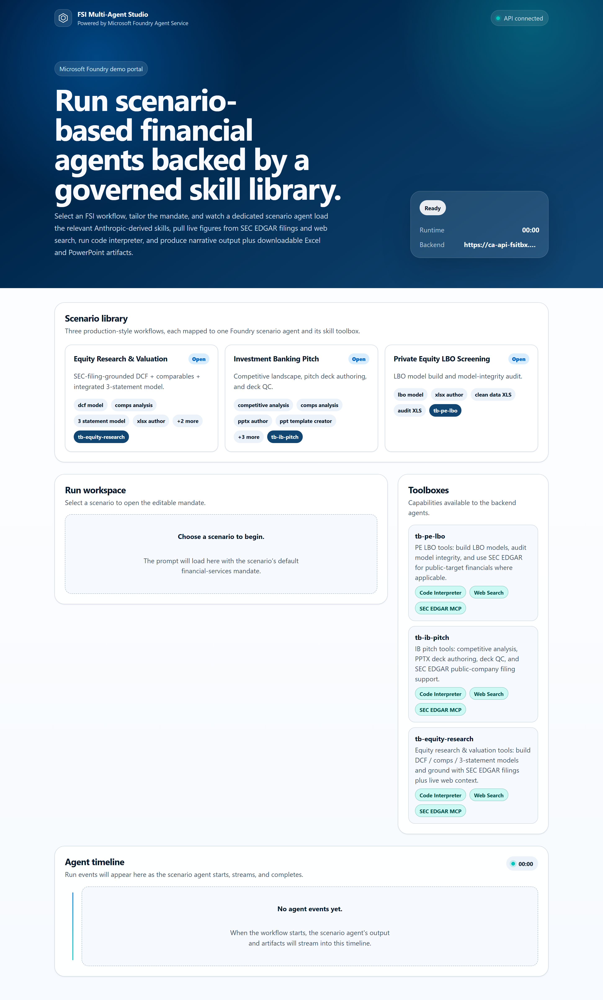
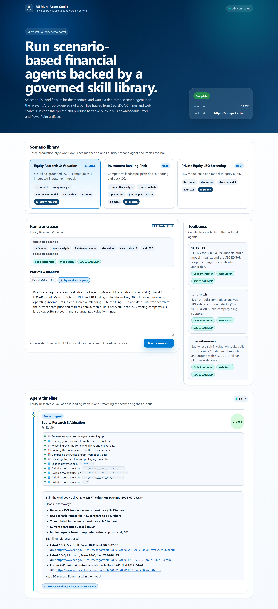
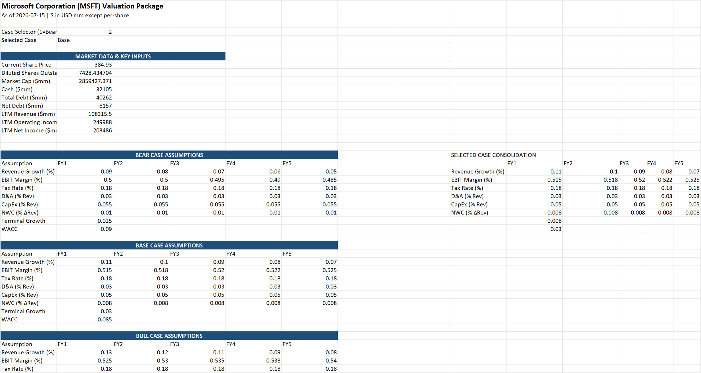
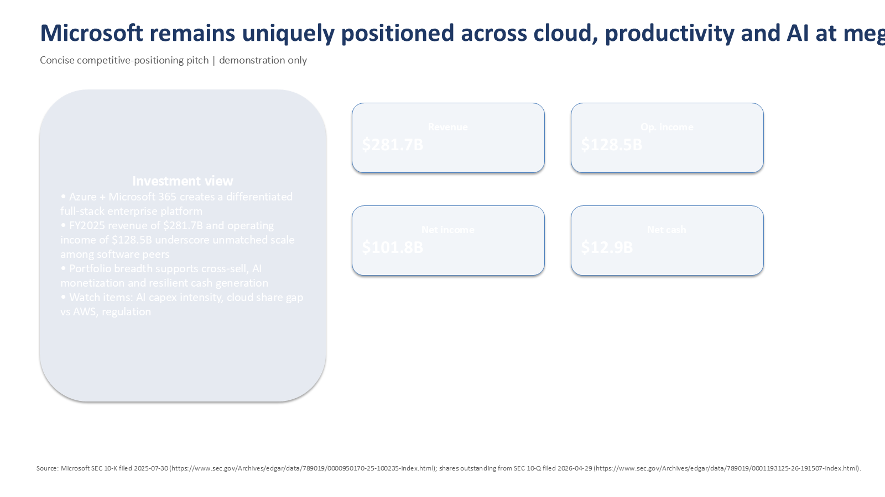
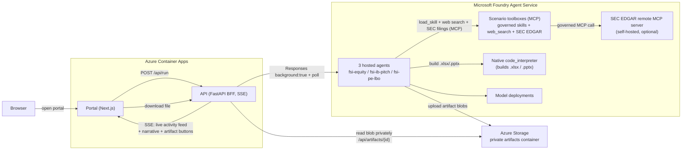

# FSI Multi-Agent Demo on Microsoft Foundry

A **reusable, deployable asset** that turns Anthropic's
[`financial-analysis`](https://github.com/anthropics/financial-services/tree/main/plugins/vertical-plugins/financial-analysis/skills)
skills into a stack of **scenario-based Microsoft Foundry hosted agents** with governed
**skills + tools in toolboxes**, fronted by a FastAPI BFF and a Next.js portal on Azure
Container Apps.

Clone it, run one script, and you get three working FSI scenario agents in your own
subscription. Every resource name is derived from a single `environmentName`; nothing is
hardcoded to a particular deployment.

> Every scenario analyses a **real public company** (the default one-click prompts use
> **Microsoft / MSFT**), sourcing figures live from **SEC EDGAR** filings and web search.
> All output is AI-generated for demonstration only and is **not investment advice**.

## Scenarios

The agent landscape is **scenario-based, not skill-based**: one hosted agent per business
workflow, each reaching its skills through a scenario toolbox.

| Scenario | Hosted agent | Toolbox | Anthropic skills used | Output |
|---|---|---|---|---|
| **Equity Research & Valuation** | `fsi-equity` | `tb-equity-research` | `3-statement-model`, `dcf-model`, `comps-analysis`, `xlsx-author`, `clean-data-xls`, `audit-xls` | `.xlsx` valuation workbook |
| **Investment Banking Pitch** | `fsi-ib-pitch` | `tb-ib-pitch` | `competitive-analysis`, `comps-analysis`, `pptx-author`, `ppt-template-creator`, `deck-refresh`, `ib-check-deck`, `xlsx-author` | `.pptx` pitch deck |
| **Private Equity LBO Screening** | `fsi-pe-lbo` | `tb-pe-lbo` | `lbo-model`, `xlsx-author`, `clean-data-xls`, `audit-xls` | `.xlsx` LBO workbook |

Each scenario analyses a **real public company** end-to-end: the agent resolves the
company in **SEC EDGAR**, pulls its latest 10-K/10-Q financials via a self-hosted remote
MCP tool, adds live market context with **web search**, and models it in
**code interpreter**. The default one-click prompts target Microsoft (MSFT); edit the
mandate to analyse any ticker.

## What it looks like

Everything below is produced by the **default one-click Microsoft (MSFT) prompts** — no
synthetic data. The images are regenerated from a live deployment with
[`scripts/capture_screenshots.ps1`](scripts/screenshots/README.md).

### The portal



*Scenario gallery — one hosted agent per FSI workflow, with each toolbox's governed
skills and tools (Code Interpreter, Web Search, SEC EDGAR MCP) shown on the right.*



*A completed **Equity Research** run. The live activity feed shows the agent loading
governed skills and calling toolbox-routed tools (`sec_edgar___get_company_info`,
`sec_edgar___get_recent_filings`, `sec_edgar___get_key_metrics`, `web`) and the code
interpreter; the narrative cites **real SEC filing URLs**; and the finished workbook is
offered as a **download button** (`MSFT_valuation_package_*.xlsx`).*

### Generated artifacts



*Equity Research → `.xlsx`: a base/bull/bear DCF with WACC and SEC-sourced market data
(share price, shares outstanding, cash, debt), authored in the code interpreter from the
Anthropic `dcf-model` + `xlsx-author` skills.*



*Investment Banking → `.pptx`: a competitive-positioning slide (scale vs. platform
breadth) from the `competitive-analysis` + `pptx-author` skills. The IB run also emits a
supporting `.pptx` deck and `.xlsx` model as download buttons.*

## Quickstart

### Prerequisites

- An Azure subscription with **Foundry model quota** in your target region (default
  `eastus2`) for the model deployments in `infra/modules/foundry.bicep`.
- Tools on PATH: **Azure CLI (`az`)**, **Azure Developer CLI (`azd`)**, **`gh`** (GitHub
  CLI, authenticated — `deploy.ps1` reads `gh auth token` to let `azd` deploy the hosted
  agents), **Python 3.11+**.
- The azd **Foundry agents** extension, which provides the hosted-agent `azd deploy` and
  `azd ai agent` commands:
  ```powershell
  azd extension install azure.ai.agents   # verify: azd ai agent --help
  ```
- `az login` to the target subscription. If you have more than one subscription, either
  `az account set --subscription <id>` first or pass `-SubscriptionId <id>` to `deploy.ps1`.
- Python deps for the provisioning scripts (pinned):
  ```powershell
  pip install -r agents/scripts/requirements.txt
  ```

> `deploy.ps1` preflights these: it fails fast with the exact fix command if the
> `azure.ai.agents` extension or the Python deps are missing, **before** provisioning any
> billable infra.

### Deploy

```powershell
# From the repo root
./deploy.ps1 -EnvName fsi-demo -Location eastus2

# ...or with SEC EDGAR public-filing grounding enabled:
./deploy.ps1 -EnvName fsi-demo -Location eastus2 `
    -SecEdgarUserAgent "Jane Doe (jane@example.com)"
```

`deploy.ps1` runs the whole ordered, idempotent flow: provision infra → register skills &
toolboxes → (optional) deploy SEC EDGAR MCP → bind skills → configure the azd agent
environment → deploy the three hosted agents → grant agent RBAC → build & deploy the API
and portal → validate all three scenarios. Use `-EnvName <other>` to stand up an isolated
second deployment; every resource is namespaced by it.

Useful switches for constrained or governed subscriptions:

- `-ModelCapacity <thousands-of-TPM>` (default `150`) — lower it if your `gpt-5.4`
  GlobalStandard quota is tight. That quota is **subscription-global** (every region shows the
  same used/limit), so region-hopping won't free it — purge an unused Foundry account instead.
- `-PrincipalId <objectId>` — pass your Entra object ID explicitly if `az ad signed-in-user show`
  can't resolve it (e.g. under a Conditional Access / CAE challenge). `deploy.ps1` otherwise
  resolves it from Graph or the ARM token's `oid` claim, and **stops fast** if all paths fail
  rather than skipping developer RBAC and failing later at skill registration.
- If a subscription/management-group **Azure Policy** keeps flipping storage
  `publicNetworkAccess` back to `Disabled`, `deploy.ps1` self-heals via
  `scripts/ensure_storage_public.ps1` (creates a resource-group-scoped Waiver exemption). See the
  runbook's *Storage public network access & policy exemptions* section if you lack policy
  permissions.

Resume after a failure with the `-Skip*` switches (e.g. `-SkipInfra -SkipSkills`).

See [`docs/runbook.md`](docs/runbook.md) for step-by-step internals, RBAC, gotchas, and
teardown, and [`.env.example`](.env.example) for every configurable variable.

## Architecture



### Runtime flow

1. The portal loads scenario metadata (`GET /api/scenarios`, `GET /api/toolboxes`).
2. The user starts a scenario (`POST /api/run`, body `{ "scenario": "...", "message": "..." }`).
   The response is a **Server-Sent Events** stream, so the portal renders a **live activity
   feed** (lifecycle phases plus the real governed tool calls — `load_skill`, `web`,
   `sec_edgar___*`) instead of a static spinner while the run is in flight.
3. The API authenticates with `DefaultAzureCredential` (Container App managed identity) and
   invokes the scenario's hosted agent over the Foundry **Responses** protocol in
   **background mode** (`stream:false, store:true, background:true`), then polls until
   complete — this avoids gateway disconnects on long Code Interpreter work.
4. The hosted agent loads only the skills it needs from its toolbox over MCP, runs
   `web_search` and (optionally) SEC EDGAR filing tools **through the same governed
   toolbox**, then builds the deliverable with native `code_interpreter`.
5. The agent's `ArtifactEgressMiddleware` uploads generated files to the private
   `artifacts` Blob container and appends a sentinel
   `<<<ARTIFACT name=<file> blob=<container>/<path>>>>` to the response text.
6. The API parses the sentinel, downloads the blob privately with managed identity, strips
   any dead `sandbox:/mnt/data/...` links the model may have narrated, and streams the
   clean narrative (rendered as markdown) plus a real **download button** per artifact
   (`GET /api/artifacts/{id}`) to the portal.

## Design principles (do not regress)

1. **Design agents by scenario, not by skill.** One hosted agent per workflow; skills reach
   it through a scenario toolbox.
2. **Skills are governed Foundry skills**, registered centrally from a pinned Anthropic
   commit and bound to toolboxes — never pasted into static prompts. The runtime consumes
   them via `FoundryToolbox.as_skills_provider()` + `load_skill`.
3. **Route tools through the toolbox; keep `code_interpreter` native.** `web_search` and the
   SEC EDGAR MCP tool execute **through** each scenario toolbox — at runtime the agent opens
   a `load_tools=True` toolbox connection with an `allowed_tools` allow-list, so the toolbox
   is the single, unified, governed tool surface, not just a catalog. `code_interpreter` is
   the one exception: the preview toolbox Code Interpreter returns server-side 500s, so it is
   excluded from the allow-list and executed as the reliable Foundry-native hosted tool. It
   is still listed in each toolbox catalog for a complete, portal-visible inventory.
4. **SEC EDGAR is a self-hosted remote MCP tool**, not in-container code. It runs as its own
   Container App and is attached as a Foundry-native remote MCP tool; the gateway injects a
   shared-secret header, so the endpoint is unusable without the key.
5. **Keep artifact storage network-reachable.** Blob egress uses AAD/RBAC over the public
   endpoint (`allowSharedKeyAccess=false`, no anonymous access). Keep
   `publicNetworkAccess=Enabled` unless you add private endpoints for both the agent compute
   and the Container Apps env — RBAC alone is not sufficient. A subscription/management-group
   **Azure Policy** can flip it back to `Disabled` at create time and again *after* deploy,
   breaking artifact download with an `AuthorizationFailure` that looks like a missing role.
   `deploy.ps1` self-heals via `scripts/ensure_storage_public.ps1`, which re-asserts `Enabled`,
   **verifies it actually stuck** (a Policy `modify` effect makes a plain
   `az storage account update` silently no-op), and creates a resource-group-scoped Waiver
   policy exemption if a policy is reverting it. See the runbook if you lack policy permissions.

## Troubleshooting

The failures below are the ones actually hit while building and dogfooding this asset. Full
detail and manual repair steps live in [`docs/runbook.md` §8](docs/runbook.md#8-known-gotchas-these-caused-real-hard-to-diagnose-failures).

| Symptom | Likely cause | Fix |
|---|---|---|
| Download buttons missing — only a `*_agent_summary.*` fallback file appears; agent logs `AuthorizationFailure` on blob upload | Storage `publicNetworkAccess` was flipped to `Disabled` — often by a subscription/management-group **Azure Policy** *after* deploy. The error wording is identical to a missing RBAC role, but the instance identities already hold `Storage Blob Data Contributor`; it's a **network** block, not identity. | `deploy.ps1` self-heals via `scripts/ensure_storage_public.ps1` at step 1 and step 7b (re-asserts Enabled, verifies it stuck, and creates a Waiver exemption if a `modify` policy is reverting it — a plain `az storage account update` silently no-ops under such a policy). If you lack `policyExemptions/write`, ask a Policy owner for an RG exemption, or use private endpoints. |
| `deploy.ps1` stops at infra with "could not resolve principal id" | `az ad signed-in-user show` returned nothing — usually a Conditional Access / CAE token challenge. | Re-run with `-PrincipalId <your-object-id>` (`az ad signed-in-user show --query id -o tsv`, or copy the `oid` from the error). |
| Skill registration fails with an `agents/read` permission error | Developer RBAC was skipped because the principal id resolved blank on an older run. | Fixed by the fail-fast principal resolver above; if you already hit it, assign **Azure AI User** + **Cognitive Services User** to your object ID on the Foundry account and resume with `-SkipInfra`. |
| Infra fails with `ManagedEnvironmentCapacityHeavyUsageError` | The region has model quota but is out of **Container Apps** capacity (independent of model quota). | Deploy in another region (East US 2 is the tested default). |
| A download link opens the portal root / a dead `sandbox:/mnt/data/...` link | The model narrated a sandbox link instead of relying on the real file. | The BFF strips these automatically (`orchestrator._strip_sandbox_links`) — use the artifact **button**. If *no* button appears at all, it's the storage-network issue above. |
| `az acr build` exits non-zero with `UnicodeEncodeError: 'charmap'` on Windows | Cosmetic crash in the CLI's log streamer; the server-side build actually **succeeded**. | Ignore the exit code and verify with `az acr task list-runs --registry <acr> --top 1 -o table`. `deploy.ps1` handles this automatically. |
| `azd deploy` fails with `AzureCLICredential: exit status 1` | Credential lookup flakes under back-to-back deploys. | Deploy one agent at a time and retry (`deploy.ps1` retries 3×). Ensure `azd config set auth.useAzCliAuth true`. |
| A scenario 408-times out (~360s), or validation reports 2/3 | A heavy single prompt (deep SEC retrieval + full multi-sheet model) at the model layer, or a transient `500`/`429` on the poll GET. | Expected: the BFF retries the poll, runs a corrective artifact turn, and finally emits a **type-correct** fallback file. Re-run the single scenario. |
| Provisioning (step 1) fails `InsufficientQuota` with no live resources present | A previously-deleted env left a **soft-deleted Foundry account** still holding model TPM. | `az cognitiveservices account list-deleted -o table`, then `az cognitiveservices account purge ...` (see runbook §10). |
| SEC EDGAR tools never fire | SEC MCP not deployed / `SEC_EDGAR_MCP_URL` unset, or `SEC_EDGAR_USER_AGENT` (a real contact string) missing on the MCP app. | Deploy with `-SecEdgarUserAgent "Name (you@example.com)"`, confirm `SEC_EDGAR_MCP_URL` is set and bound into the toolboxes. SEC EDGAR is optional; web search still grounds the analysis. |
| Redeployed an agent but behavior didn't change | The deployed copy in `agents/hosted/_azd/agent-src/` is stale. | Re-sync before deploying and confirm with `Get-FileHash` (see runbook §4). |

## Repository structure

```text
.
├── deploy.ps1              # one-command end-to-end deploy orchestrator
├── .env.example            # every configurable variable, documented
├── infra/                  # subscription-scoped bicep (RG, Foundry, ACR, Storage, KV, ACA, RBAC)
├── agents/
│   ├── hosted/             # env-driven hosted-agent runtime + Blob artifact egress + azd project
│   ├── mcp/sec-edgar/      # self-hosted SEC EDGAR remote MCP server (optional)
│   └── scripts/            # register skills, create + bind toolboxes
├── api/                    # FastAPI BFF (background Responses, SSE, artifact proxy)
├── portal/                 # Next.js portal (3 scenario tabs, streaming, artifact download)
├── scripts/                # deploy helpers + generic end-to-end validator
└── docs/runbook.md         # operations runbook, RBAC, gotchas, teardown
```

## Reusing this pattern for your own skills

1. **Pin the upstream skill source.** `agents/scripts/provision_skills.py` fetches each
   `SKILL.md` from a pinned commit of the Anthropic repo (`ANTHROPIC_SKILLS_REF`). Point it
   at your own skill catalog and adjust the `RUNTIME_SKILLS` list.
2. **Map skills to scenarios.** Edit the toolbox → skill bindings in
   `agents/scripts/bind_skills_to_toolboxes.py` and the scenario metadata in
   `api/app/config.py`.
3. **Add scenarios or change models** via `agents/hosted/_azd/azure.yaml` (one service per
   scenario, env-driven) and the `agentModelDeploymentName` parameter in `infra/main.bicep`.
4. **Connect live vendor data** by registering vendor MCP tools in the Foundry project and
   exposing them only through the toolbox that needs them (see the runbook).

## Official references

- [Microsoft Foundry hosted agents](https://learn.microsoft.com/en-us/azure/foundry/agents/concepts/hosted-agents)
- [Foundry Agent Service runtime components](https://learn.microsoft.com/en-us/azure/foundry/agents/concepts/runtime-components)
- [Use a toolbox in Foundry Agent Service](https://learn.microsoft.com/en-us/azure/foundry/agents/how-to/tools/toolbox)
- [Foundry tools overview](https://learn.microsoft.com/en-us/azure/foundry/agents/concepts/tool-catalog)
- [Anthropic financial-analysis skills](https://github.com/anthropics/financial-services/tree/main/plugins/vertical-plugins/financial-analysis/skills)
- [`sec-edgar-mcp`](https://github.com/stefanoamorelli/sec-edgar-mcp) (upstream license: AGPL-3.0)
