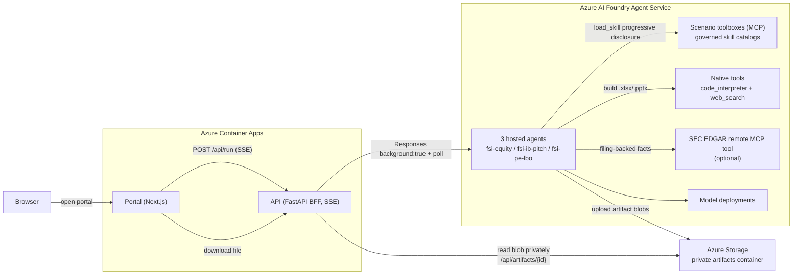

# FSI Multi-Agent Demo on Azure AI Foundry

A **reusable, deployable asset** that turns Anthropic's
[`financial-analysis`](https://github.com/anthropics/financial-services/tree/main/plugins/vertical-plugins/financial-analysis/skills)
skills into a stack of **scenario-based Azure AI Foundry hosted agents** with governed
**skills + tools in toolboxes**, fronted by a FastAPI BFF and a Next.js portal on Azure
Container Apps.

Clone it, run one script, and you get three working FSI scenario agents in your own
subscription. Every resource name is derived from a single `environmentName`; nothing is
hardcoded to a particular deployment.

> All companies, peers, figures, and assumptions bundled here are **synthetic** for
> demonstration only. This is not investment advice.

## Scenarios

The agent landscape is **scenario-based, not skill-based**: one hosted agent per business
workflow, each reaching its skills through a scenario toolbox.

| Scenario | Hosted agent | Toolbox | Anthropic skills used | Output |
|---|---|---|---|---|
| **Equity Research & Valuation** | `fsi-equity` | `tb-equity-research` | `3-statement-model`, `dcf-model`, `comps-analysis`, `xlsx-author`, `clean-data-xls`, `audit-xls` | `.xlsx` valuation workbook |
| **Investment Banking Pitch** | `fsi-ib-pitch` | `tb-ib-pitch` | `competitive-analysis`, `comps-analysis`, `pptx-author`, `ppt-template-creator`, `deck-refresh`, `ib-check-deck`, `xlsx-author` | `.pptx` pitch deck |
| **Private Equity LBO Screening** | `fsi-pe-lbo` | `tb-pe-lbo` | `lbo-model`, `xlsx-author`, `clean-data-xls`, `audit-xls` | `.xlsx` LBO workbook |

Optionally, agents can ground public-company claims in **SEC EDGAR** filings via a
self-hosted remote MCP tool.

## Quickstart

### Prerequisites

- An Azure subscription with **Foundry model quota** in your target region (default
  `eastus2`) for the model deployments in `infra/modules/foundry.bicep`.
- Tools on PATH: **Azure CLI (`az`)**, **Azure Developer CLI (`azd`)** with the
  `azure.ai.agent` capability, **`gh`** (GitHub CLI, authenticated), **Python 3.11+**.
- `az login` to the target subscription.
- Python deps for the provisioning scripts:
  `pip install azure-ai-projects azure-identity`.

### Deploy

```powershell
# From the repo root
./deploy.ps1 -EnvName fsi-demo -Location eastus2

# ...or with SEC EDGAR public-filing grounding enabled:
./deploy.ps1 -EnvName fsi-demo -Location eastus2 `
    -SecEdgarUserAgent "Jane Doe (jane@example.com)"
```

`deploy.ps1` runs the whole ordered, idempotent flow: provision infra → register skills &
toolboxes → (optional) deploy SEC EDGAR MCP → bind skills → configure the azd agent
environment → deploy the three hosted agents → grant agent RBAC → build & deploy the API
and portal → validate all three scenarios. Use `-EnvName <other>` to stand up an isolated
second deployment; every resource is namespaced by it.

Resume after a failure with the `-Skip*` switches (e.g. `-SkipInfra -SkipSkills`).

See [`docs/runbook.md`](docs/runbook.md) for step-by-step internals, RBAC, gotchas, and
teardown, and [`.env.example`](.env.example) for every configurable variable.

## Architecture



### Runtime flow

1. The portal loads scenario metadata (`GET /api/scenarios`, `GET /api/toolboxes`).
2. The user starts a scenario (`POST /api/run`, body `{ "scenario": "...", "message": "..." }`).
3. The API authenticates with `DefaultAzureCredential` (Container App managed identity) and
   invokes the scenario's hosted agent over the Foundry **Responses** protocol in
   **background mode** (`stream:false, store:true, background:true`), then polls until
   complete — this avoids gateway disconnects on long Code Interpreter work.
4. The hosted agent loads only the skills it needs from its toolbox over MCP, optionally
   calls SEC EDGAR tools, then builds the deliverable with native `code_interpreter`.
5. The agent's `ArtifactEgressMiddleware` uploads generated files to the private
   `artifacts` Blob container and appends a sentinel
   `<<<ARTIFACT name=<file> blob=<container>/<path>>>>` to the response text.
6. The API parses the sentinel, downloads the blob privately with managed identity, and
   streams the narrative plus an artifact link (`GET /api/artifacts/{id}`) to the portal.

## Design principles (do not regress)

1. **Design agents by scenario, not by skill.** One hosted agent per workflow; skills reach
   it through a scenario toolbox.
2. **Skills are governed Foundry skills**, registered centrally from a pinned Anthropic
   commit and bound to toolboxes — never pasted into static prompts. The runtime consumes
   them via `FoundryToolbox.as_skills_provider()` + `load_skill`.
3. **Use native Foundry tools for execution.** `code_interpreter` and `web_search` come from
   the project client (the preview toolbox Code Interpreter returns server-side 500s). The
   toolbox stays the governed, portal-visible catalog.
4. **SEC EDGAR is a self-hosted remote MCP tool**, not in-container code. It runs as its own
   Container App and is attached as a Foundry-native remote MCP tool; the gateway injects a
   shared-secret header, so the endpoint is unusable without the key.
5. **Keep artifact storage network-reachable.** Blob egress uses AAD/RBAC over the public
   endpoint (`allowSharedKeyAccess=false`, no anonymous access). Keep
   `publicNetworkAccess=Enabled` unless you add private endpoints for both the agent compute
   and the Container Apps env — RBAC alone is not sufficient.

## Repository structure

```text
.
├── deploy.ps1              # one-command end-to-end deploy orchestrator
├── .env.example            # every configurable variable, documented
├── infra/                  # subscription-scoped bicep (RG, Foundry, ACR, Storage, KV, ACA, RBAC)
├── agents/
│   ├── hosted/             # env-driven hosted-agent runtime + Blob artifact egress + azd project
│   ├── mcp/sec-edgar/      # self-hosted SEC EDGAR remote MCP server (optional)
│   └── scripts/            # register skills, create + bind toolboxes
├── api/                    # FastAPI BFF (background Responses, SSE, artifact proxy) + synthetic data
├── portal/                 # Next.js portal (3 scenario tabs, streaming, artifact download)
├── scripts/                # deploy helpers + generic end-to-end validator
└── docs/runbook.md         # operations runbook, RBAC, gotchas, teardown
```

## Reusing this pattern for your own skills

1. **Pin the upstream skill source.** `agents/scripts/provision_skills.py` fetches each
   `SKILL.md` from a pinned commit of the Anthropic repo (`ANTHROPIC_SKILLS_REF`). Point it
   at your own skill catalog and adjust the `RUNTIME_SKILLS` list.
2. **Map skills to scenarios.** Edit the toolbox → skill bindings in
   `agents/scripts/bind_skills_to_toolboxes.py` and the scenario metadata in
   `api/app/config.py`.
3. **Add scenarios or change models** via `agents/hosted/_azd/azure.yaml` (one service per
   scenario, env-driven) and the `agentModelDeploymentName` parameter in `infra/main.bicep`.
4. **Connect live vendor data** by registering vendor MCP tools in the Foundry project and
   exposing them only through the toolbox that needs them (see the runbook).

## Official references

- [Azure AI Foundry hosted agents](https://learn.microsoft.com/azure/ai-foundry/agents/concepts/hosted-agents?view=foundry)
- [Foundry Agent Service runtime components](https://learn.microsoft.com/azure/ai-foundry/agents/concepts/runtime-components?view=foundry)
- [Foundry tools overview](https://learn.microsoft.com/azure/ai-foundry/agents/how-to/tools/overview?view=foundry)
- [Anthropic financial-analysis skills](https://github.com/anthropics/financial-services/tree/main/plugins/vertical-plugins/financial-analysis/skills)
- [`sec-edgar-mcp`](https://github.com/stefanoamorelli/sec-edgar-mcp) (upstream license: AGPL-3.0)
