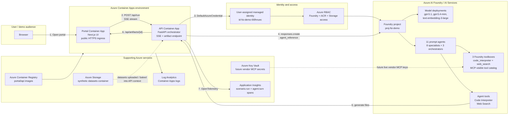

# FSI Multi-Agent Demo on Azure AI Foundry

This repository contains a deployed Financial Services Industry (FSI) multi-agent demo that adapts Anthropic's [`financial-analysis`](https://github.com/anthropics/financial-services/tree/main/plugins/vertical-plugins/financial-analysis/skills) skill patterns onto **Azure AI Foundry Agent Service**.

The demo shows three analyst workflows through a visible web portal:

| Scenario | Agent pipeline | Output |
|---|---|---|
| **Equity Research & Valuation** | 3-Statement Model -> DCF -> Trading Comps -> Orchestrator | `.xlsx` valuation package |
| **Investment Banking Pitch** | Competitive Analysis -> PPTX Author -> Deck QC -> Orchestrator | `.pptx` pitch deck |
| **Private Equity LBO Screening** | LBO Model -> Model Audit -> Orchestrator | `.xlsx` LBO workbook |

All companies, peers, figures, and assumptions are **synthetic** for demonstration purposes only. This is not investment advice.

## Live deployment

| Resource | Value |
|---|---|
| Portal | https://ca-portal-fsi-demo.orangecoast-891e69ba.eastus2.azurecontainerapps.io |
| API | https://ca-api-fsi-demo.orangecoast-891e69ba.eastus2.azurecontainerapps.io |
| Azure resource group | `rg-fsi-demo` |
| Region | `eastus2` |
| Foundry project endpoint | `https://aif66lhnuec.services.ai.azure.com/api/projects/proj-fsi-demo` |

## Repository structure

```text
.
|-- agents/    # Foundry toolbox + prompt-agent creation scripts and agent instructions
|-- api/       # FastAPI orchestration backend, SSE streaming, artifact download, telemetry
|-- data/      # Synthetic FSI datasets for NovaGrid Technologies and fictional peers
|-- docs/      # Detailed demo runbook
|-- infra/     # Bicep infrastructure for Azure services
|-- portal/    # Next.js visible web portal
`-- scripts/   # Scenario validation / evaluation helpers
```

## Azure architecture



## Where Azure services and features are used

| Azure service / feature | Where it appears | Purpose in the flow |
|---|---|---|
| **Resource Group** | `rg-fsi-demo` | Single boundary for demo resources and teardown. |
| **Azure AI Foundry / AI Services account** | `aif66lhnuec` | Hosts the Foundry project, model deployments, agents, and toolboxes. |
| **Foundry project** | `proj-fsi-demo` | Data-plane endpoint used by the API to invoke prompt agents. |
| **Model deployments** | `gpt-5.1`, `gpt-5.4-mini`, `text-embedding-3-large` | Reasoning and embedding capacity for the multi-agent workflows. |
| **Foundry Agent Service prompt agents** | 8 specialist agents + 3 orchestrators | Encapsulate the converted Anthropic FSI skill instructions and perform each workflow step. |
| **Foundry toolboxes** | `tb-equity-research`, `tb-ib-pitch`, `tb-pe-lbo` | Shared tool catalog for each scenario; exposes `code_interpreter` and `web_search` as MCP-visible tools. |
| **Code Interpreter tool** | Attached directly to agents | Produces real spreadsheet/deck artifacts (`.xlsx`, `.pptx`) and returns Foundry container-file annotations. |
| **Web Search tool** | Attached directly to agents / listed in toolboxes | Provides grounding capability for narrative and market-context steps. |
| **Azure Container Apps** | `ca-portal-fsi-demo`, `ca-api-fsi-demo` | Hosts the visible portal and backend API with public HTTPS ingress, revisions, and scale rules. |
| **Azure Container Registry** | `acr66lhnuec` | Stores the portal and API container images consumed by Container Apps. |
| **User-assigned managed identity** | `id-fsi-demo-66lhnuec` | Lets Container Apps authenticate to Foundry, ACR, and Storage without secrets. The API sets `AZURE_CLIENT_ID` so `DefaultAzureCredential` selects this identity. |
| **Azure RBAC** | Foundry, ACR, Storage assignments | Grants the managed identity data-plane access to call Foundry and pull images / read data. |
| **Azure Storage** | `st66lhnuec` | Stores uploaded synthetic datasets. Generated artifacts are currently served by the API from container temp storage after retrieval from Foundry Code Interpreter. |
| **Azure Key Vault** | `kv-fsi-demo-66lhnuec` | Reserved for future live vendor MCP credentials (FactSet, PitchBook, Moody's, etc.). No secrets are committed. |
| **Application Insights** | `appi-fsi-demo-66lhnuec` | Receives OpenTelemetry spans from the API, including one span per scenario and per agent turn. |
| **Log Analytics** | Container Apps managed environment | Stores container runtime logs for portal/API diagnostics. |
| **Bicep** | `infra/` | Reproducible infrastructure deployment for all Azure resources above. |

## Runtime flow

1. A user opens the **Next.js portal** hosted on Azure Container Apps.
2. The portal loads available scenarios and Foundry toolboxes from the FastAPI backend:
   - `GET /api/scenarios`
   - `GET /api/toolboxes`
3. The user starts a scenario. The portal sends:
   - `POST /api/run`
   - body: `{ "scenario": "equity-research" | "ib-pitch" | "pe-lbo", "message": "..." }`
4. The API authenticates with **DefaultAzureCredential** using the Container App's **user-assigned managed identity**.
5. The API invokes Foundry prompt agents through the OpenAI-compatible responses API:
   - `responses.create(..., extra_body={"agent_reference": {"name": "<agent>", "type": "agent_reference"}})`
6. Specialist agents run in sequence. Each receives:
   - the user request,
   - synthetic financial context,
   - upstream specialist output,
   - instructions adapted from Anthropic financial-analysis skills.
7. Agent tools are used at the point of work:
   - **Code Interpreter** builds `.xlsx` / `.pptx` files.
   - **Web Search** is available for grounding and market-context reasoning.
8. The API streams live progress back to the portal through **Server-Sent Events**:
   - `status`
   - `agent_start`
   - `delta`
   - `artifact`
   - `agent_end`
   - `done`
9. When Code Interpreter produces a file, Foundry returns a container-file citation (`container_id`, `file_id`, `filename`). The API downloads that file and exposes it through:
   - `GET /api/artifacts/{artifact_id}`
10. The portal renders download links for the generated workbook or deck.
11. The API emits **OpenTelemetry** telemetry to Application Insights:
   - `scenario.run`
   - `agent.turn`

## Agent and toolbox design

The original Anthropic financial-analysis skills were translated into Foundry prompt-agent instructions under `agents/skills/`.

| Agent type | Count | Role |
|---|---:|---|
| Specialist agents | 8 | Build individual components: DCF, comps, 3-statement model, competitive analysis, deck authoring, deck QC, LBO, model audit. |
| Orchestrator agents | 3 | Synthesize each scenario into final executive output. |
| Toolboxes | 3 | Scenario-specific shared tool catalog visible in the portal and available through Foundry toolbox MCP endpoints. |

The backend uses an **orchestrator-worker pattern** rather than relying on black-box automatic delegation. This keeps the sequence deterministic, streams progress to the UI, and lets the API attach tracing and artifact handling to every agent turn.

## Artifacts

Artifacts are visible after a scenario finishes in the **portal live stream**. Each `artifact` SSE event contains a filename and a URL like:

```text
/api/artifacts/{artifact_id}
```

The backend currently persists generated files in the API container's temp directory and indexes them in memory. This is sufficient for a live demo, but links are not durable across container restarts or new revisions. For long-lived sharing, the next production step is to persist generated artifacts to Azure Storage Blob and return blob/SAS URLs.

## Observability

The API is instrumented with `azure-monitor-opentelemetry` in `api/app/telemetry.py`.

Health check:

```powershell
Invoke-RestMethod https://ca-api-fsi-demo.orangecoast-891e69ba.eastus2.azurecontainerapps.io/api/health
```

Expected signal:

```json
{
  "status": "ok",
  "telemetry": true
}
```

Useful Application Insights query:

```kusto
dependencies
| where timestamp > ago(1h)
| where name in ("scenario.run", "agent.turn")
| project timestamp, name, customDimensions
| order by timestamp desc
```

## Running scenario validation

Run all three scenario smoke/eval checks:

```powershell
cd C:\Users\samsonlee\GHCP\fsi-multiagent-demo
.\agents\.venv\Scripts\python.exe .\scripts\eval_scenarios.py
```

Run one scenario:

```powershell
.\agents\.venv\Scripts\python.exe .\scripts\eval_scenarios.py pe-lbo
```

The eval script asserts:

1. the expected agents ran,
2. at least one expected artifact type was produced,
3. no error events were emitted.

## Rebuild and redeploy

### API

```powershell
cd C:\Users\samsonlee\GHCP\fsi-multiagent-demo
$env:PYTHONUTF8='1'
[Console]::OutputEncoding=[System.Text.Encoding]::UTF8

az acr build --registry acr66lhnuec --image fsi-api:latest .\api
az acr task list-runs --registry acr66lhnuec --top 1 --query "[0].status" -o tsv
az containerapp update `
  -n ca-api-fsi-demo `
  -g rg-fsi-demo `
  --revision-suffix v$(Get-Date -Format 'MMddHHmmss')
```

### Portal

`NEXT_PUBLIC_*` values are build-time inlined by Next.js, so the API URL must be passed during image build.

```powershell
cd C:\Users\samsonlee\GHCP\fsi-multiagent-demo

az acr build --registry acr66lhnuec --image fsi-portal:latest `
  --build-arg NEXT_PUBLIC_API_BASE_URL=https://ca-api-fsi-demo.orangecoast-891e69ba.eastus2.azurecontainerapps.io `
  .\portal

az containerapp update `
  -n ca-portal-fsi-demo `
  -g rg-fsi-demo `
  --revision-suffix v$(Get-Date -Format 'MMddHHmmss')
```

## Recreate Foundry assets

```powershell
cd C:\Users\samsonlee\GHCP\fsi-multiagent-demo\agents
.\.venv\Scripts\python.exe .\scripts\create_toolboxes.py
.\.venv\Scripts\python.exe .\scripts\create_agents.py
```

The toolbox script uses direct Foundry REST calls because the toolbox preview API currently requires the `api-version=v1` query parameter and `Foundry-Features: Toolboxes=V1Preview` header.

## Moving from synthetic data to live vendor data

The current demo is intentionally self-contained. To connect real FSI data providers:

1. Store vendor API keys and endpoints in **Azure Key Vault**.
2. Add the provider as an MCP tool connection or toolbox tool in the Foundry project.
3. Attach the tool to the relevant specialist agents.
4. Update the corresponding instructions to prefer live vendor data over the synthetic context.

Candidate mappings:

| Workflow need | Vendor MCP examples |
|---|---|
| Market data / estimates / comps | FactSet, LSEG, Morningstar |
| Private-company / sponsor data | PitchBook, Chronograph |
| Credit and issuer context | Moody's |
| Transcripts / news | Aiera, MT Newswire |
| Source documents | Box, Egnyte |

## Teardown

All Azure resources are grouped in `rg-fsi-demo`:

```powershell
az group delete --name rg-fsi-demo --yes --no-wait
```

## More detail

See [`docs/runbook.md`](docs/runbook.md) for the demo script, detailed operations notes, validation results, and gotchas captured during the build.

For a standalone, print-friendly version of this overview, open [`docs/fsi-multi-agent-demo-report.html`](docs/fsi-multi-agent-demo-report.html).
